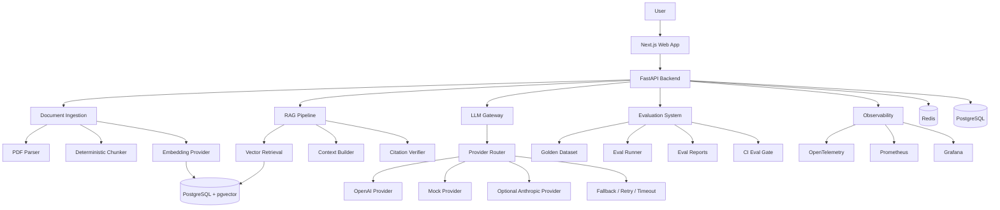

# Architecture

## Purpose

This document describes the planned architecture of the LLM Reliability Platform.

The platform is designed as a production-grade LLMOps system for RAG-based AI assistants with:

- Document ingestion
- Deterministic chunking
- Vector search
- Citation-grounded answers
- LLM gateway abstraction
- Provider routing and fallback
- Evaluation gates
- OpenTelemetry tracing
- Prometheus metrics
- Grafana dashboards
- Live deployment

## High-Level Components

The following diagram shows the planned v1.0 architecture. The implementation will be completed across the roadmap milestones.



## Backend

The backend uses FastAPI with Pydantic models for request validation, response schemas, configuration and structured LLM output validation.

Main responsibilities:

- Expose API endpoints
- Validate inputs
- Parse uploaded documents
- Store documents and chunks
- Generate embeddings
- Retrieve relevant chunks
- Build grounded prompts
- Call the LLM gateway
- Return cited answers
- Emit traces and metrics

## Frontend

The frontend uses Next.js with TypeScript.

Main responsibilities:

- Public landing page
- Demo page
- Document upload UI
- Chat UI
- Citation display
- Evidence page
- Architecture and documentation links

## Data Storage

The first version uses PostgreSQL with pgvector.

Stored data includes:

- Documents
- Chunks
- Embeddings
- Chat metadata
- Provider metadata
- Evaluation results
- Audit events

## LLM Gateway

The LLM gateway abstracts provider-specific APIs.

It handles:

- Provider-independent request and response models
- Primary provider routing
- Fallback provider routing
- Retries
- Timeouts
- Token tracking
- Cost estimation
- Structured errors

## Evaluation System

The evaluation system validates that the RAG system answers correctly and cites the right sources.

It checks:

- Answer correctness
- Citation coverage
- Citation validity
- Retrieval quality
- Refusal correctness
- Latency
- Estimated cost

## Observability

The platform uses:

- OpenTelemetry for traces
- Prometheus for metrics
- Grafana for dashboards

Important signals:

- Request count
- Error count
- p50/p95 latency
- Provider latency
- Fallback count
- Token usage
- Estimated cost
- Eval score trend

## Deployment

The first production-like deployment target is:

```text
Hetzner VPS + Cloudflare + Docker Compose + Caddy
```

Kubernetes is intentionally excluded from v1.0 to keep the first version focused and operable.
